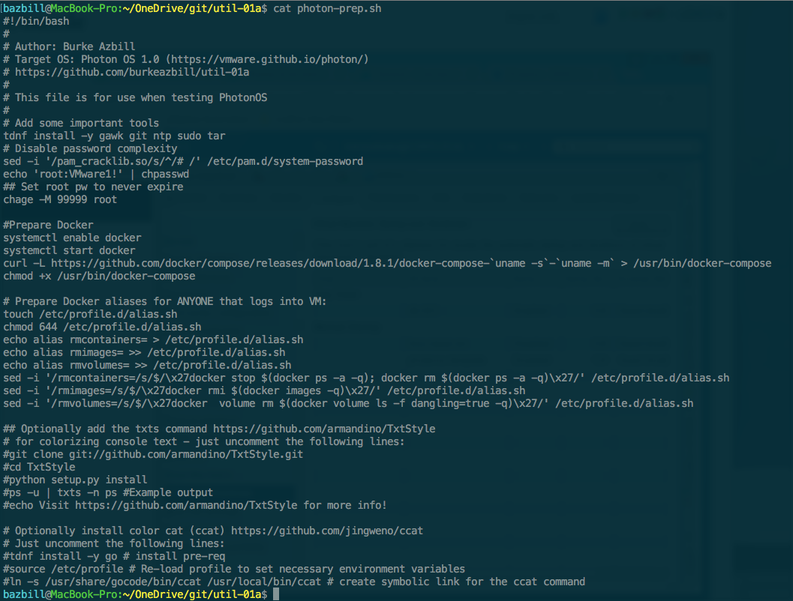
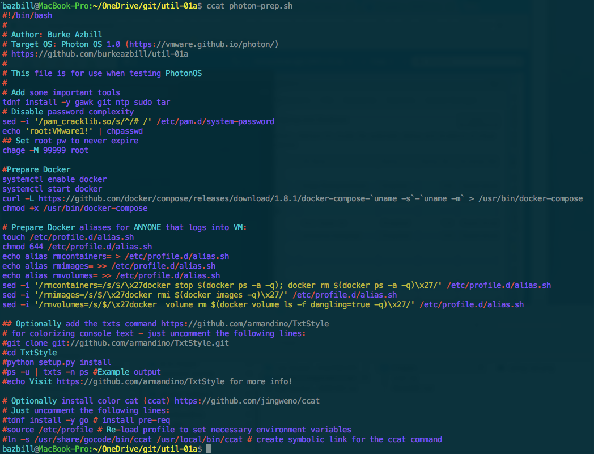

# vra-sw-component-ccat
ccat Software Component for vRealize Automation 7.2

# Overview
This zip file is intended for use with vRealize Automation 7.x and above as a software component.
It may be imported into vRA by using cloudclient.

This software component will install ccat (github.com/jingweno/ccat) into either centos or photonos (extra work needed to get photonOS to support vRA Software Components)

Just using cat:

Now, using ccat:

I realize that my dark terminal has some rough contrast there, but I find the colorized cat (ccat) results to be far more appealing :)

